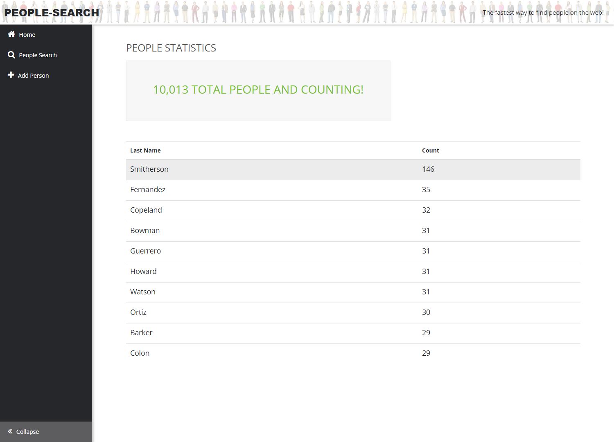
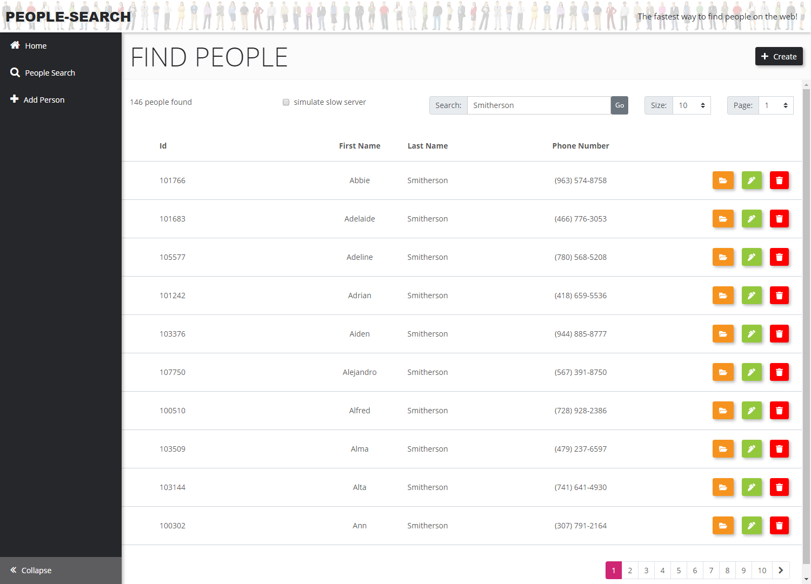

# PeopleSearch
An application to test searching.

# Software Prerequisites
- [Visual Studio 2017]
    - Install workloads: 
        - ASP<span/>.NET and web development
        - Asp.Net Core
        
NodeJS and NPM Packages:
- Install the latest [NodeJS release](https://nodejs.org/en/download/current/)
```
npm install -g node-gyp
npm install -g gulp-cli
npm install -g aurelia-cli
npm install -g node-sass
```
navigate to  [repo]\PeopleSearch\source\PeopleSearch
```
npm install
au build --env local
```
open the solution in VS and build
 1. Run solution as PeopleSearch in VS17 (may default to IIS Express)
 2. Run Aurelia from CLI
 - Run the following in your command line tool: `au build --watch --env local`
 3. Access app using Chrome at `http://localhost:5000`






